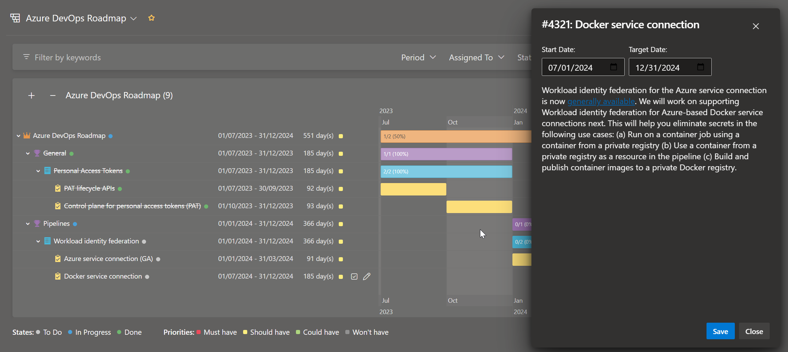

# About the extension
Query Gantt is an extension for the Azure DevOps, which enables you to view the result of the selected query in the form of a Gantt chart using the [vis-timeline](https://visjs.github.io/vis-timeline/) and export it to the excel file using the [xlsx-populate](https://github.com/dtjohnson/xlsx-populate) parser/generator.

# Features
* Zoom in/out the timeline.
* View tags, priority, state, assigned to, dates and number of days between the Start Date and Target Date.
* A single click on the work item displays the title.
* Zoom to fit the currently selected work item.
* Download the timeline in the xlsx format.
* Share the timeline via URL.
* Quick filtering using the "gmail" like filter syntax:
    * To filter items by title just type any text.
    * To filter by specific field use prefixes: *title:*, *tag:*, *state:*, *priority:*, *assignedto:*.
    * You can use multiple filter clauses and join them with logical operators *OR*/*AND*.

# Quickfilter examples
* Work items which title contains *"text"*: `text`
* Work items which title does not contain *"text"*: `-(text)`
* Work items which state is set to *"To Do"*: `state:todo`
* Multiple condition: `state:todo AND tag:customer`

# Setup
After installing the extension from the Marketplace, you need to enable it in the **Manage features**  section. In order to do so, follow the instructions [here](https://learn.microsoft.com/en-us/azure/devops/project/navigation/preview-features?view=azure-devops).

# How does it work
Query Gantt can be used for any type of the query, but only those work items which have the **Start Date** (Microsoft.VSTS.Scheduling.StartDate) and **Target Date** (Microsoft.VSTS.Scheduling.TargetDate)
set will be visualised on the timeline.

Which work items have the **Start Date** and the **Target Date** depends on the process you are using in your project. However you can add these fields to your work items following the instructions [here](https://learn.microsoft.com/en-us/azure/devops/organizations/settings/work/add-custom-field?view=azure-devops).

If the work item has set up both **Start Date** and **Target Date** it will be rendered as a bar, if the work item has set up only the **Target Date** it will be rendered as a marker on the timeline.

# Support
Email us at [info.emait@gmail.com](mailto:info.emait@gmail.com) for any help on this extension or if you would like to request a new feature.